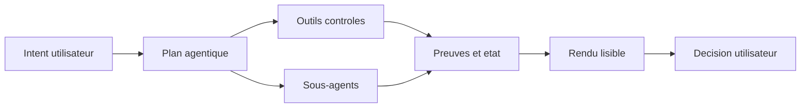
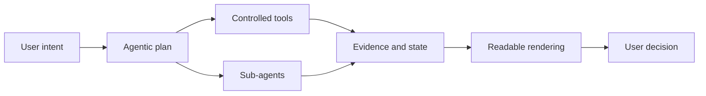

# Agentic Project Presentation / Presentation projet agentic

> Public-safe presentation repository. This repository is a showcase and partnership brief, not a source-code release.

[FR](#francais) | [EN](#english)

## Francais

### Positionnement

Ce depot presente l'axe **agentic / orchestration / Apps SDK / MCP**: des workflows ou l'agent n'est pas seulement un chat, mais une couche de pilotage, validation, delegation et rendu d'outils.

Le but est de montrer une approche produit: agents outilles, actions controlees, interfaces lisibles, preuves, garde-fous et integration locale.

### Ce que ce depot contient

- Une presentation publique et bilingue de l'axe agentic.
- Une lecture architecture produit, sans code critique.
- Des principes de securite: separation lecture/ecriture, actions explicites, audit, limites.
- Une fiche partenariat pour outils agentiques, Apps SDK, MCP et workflows locaux.
- Une cartographie des repos reels couverts, sans publier leurs implementations sensibles.

### Repos reels couverts

Ce depot est la vitrine publique de plusieurs repos et surfaces agentiques:

- `codex-model-orchestrator-plugin` - orchestrateur multi-agents, Apps SDK, MCP et proof kit, source privee/localisee.
- [`charli-dev420/codextounity`](https://github.com/charli-dev420/codextounity) - pont public Codex / Unity / ComfyUI.
- `charli-dev420/unit2comf-frontend-backend-private` - backend et frontends d'orchestration ComfyUI, prive.
- pipeline local LocalAssetFactory / Asset Factory - orchestration locale d'assets, non publiee comme code.

`brandforge-desk` n'est pas retenu dans cette vitrine.

Les details sont dans [`docs/repositories.md`](docs/repositories.md).

### Ce que ce depot ne contient pas

- Aucun code source de plugin ou serveur MCP prive.
- Aucun token, endpoint prive, secret, configuration locale ou cle API.
- Aucun outil destructif, workflow interne, preuve de scan, log ou donnees utilisateur.
- Aucun prompt prive, dataset, trace ou historique operationnel sensible.

### Vision

Un systeme agentic utile doit etre:

- outille, mais explicite;
- capable de deleguer, mais observable;
- productif, mais auditable;
- local-first quand les donnees ou secrets l'exigent;
- capable de produire des rendus lisibles, pas seulement du texte.

### Axes publics

- **MCP**: connecter des outils locaux ou distants avec des contrats clairs.
- **Apps SDK**: rendre des interfaces lisibles dans l'experience ChatGPT.
- **Orchestration**: parallelisation, delegation, suivi, resume et validation.
- **Garde-fous**: separation read-only / mutating, confirmations, journaux, perimetres.
- **Produit**: transformer l'agent en poste de travail controle, pas en simple assistant texte.

### Recherche

Le projet recherche:

- partenariats autour d'outils agentiques;
- financement pour industrialisation, securite, UX et validation;
- missions ou emploi sur Apps SDK, MCP, agents locaux, orchestration et outils developpeur;
- retours produit sur workflows agentiques reels.

### Contact

Contact public recommande: [GitHub charli-dev420](https://github.com/charli-dev420).

## English

### Positioning

This repository presents the **agentic / orchestration / Apps SDK / MCP** track: workflows where the agent is not just a chat surface, but a control layer for tools, validation, delegation, and rendered interfaces.

The goal is to show a product approach: tool-using agents, controlled actions, readable interfaces, evidence, guardrails, and local integration.

### What this repository contains

- A public bilingual presentation of the agentic track.
- A product architecture view, without critical code.
- Security principles: read/write separation, explicit actions, audit, limits.
- A partnership brief for agentic tools, Apps SDK, MCP, and local workflows.
- A map of the real repositories covered, without publishing sensitive implementations.

### Real repositories covered

This repository is the public showcase for several real agentic repositories and surfaces:

- `codex-model-orchestrator-plugin` - multi-agent orchestration, Apps SDK, MCP, and proof kit, private/local source.
- [`charli-dev420/codextounity`](https://github.com/charli-dev420/codextounity) - public Codex / Unity / ComfyUI bridge.
- `charli-dev420/unit2comf-frontend-backend-private` - ComfyUI orchestration backend and frontends, private.
- local LocalAssetFactory / Asset Factory pipeline - local asset orchestration, not published as code.

`brandforge-desk` is not retained in this showcase.

Details are in [`docs/repositories.md`](docs/repositories.md).

### What this repository does not contain

- No private plugin or MCP server source code.
- No tokens, private endpoints, secrets, local configuration, or API keys.
- No destructive tool, internal workflow, scan evidence, log, or user data.
- No private prompt, dataset, trace, or sensitive operational history.

### Vision

A useful agentic system should be:

- tool-enabled, but explicit;
- able to delegate, but observable;
- productive, but auditable;
- local-first when data or secrets require it;
- able to produce readable interfaces, not only text.

### Public tracks

- **MCP**: connect local or remote tools with clear contracts.
- **Apps SDK**: render readable interfaces inside the ChatGPT experience.
- **Orchestration**: parallelization, delegation, tracking, resume, and validation.
- **Guardrails**: read-only / mutating separation, confirmations, logs, scopes.
- **Product**: turn the agent into a controlled workstation, not just a text assistant.

### Looking for

The project is open to:

- partnerships around agentic tools;
- funding for industrialization, security, UX, and validation;
- work opportunities around Apps SDK, MCP, local agents, orchestration, and developer tools;
- product feedback on real agentic workflows.

### Contact

Recommended public contact: [GitHub charli-dev420](https://github.com/charli-dev420).
