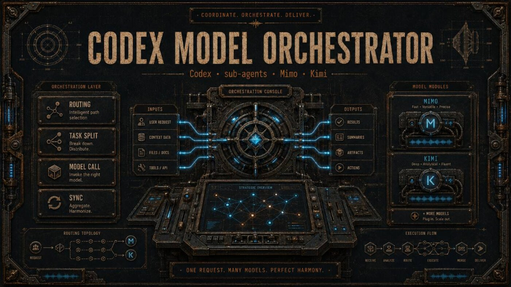
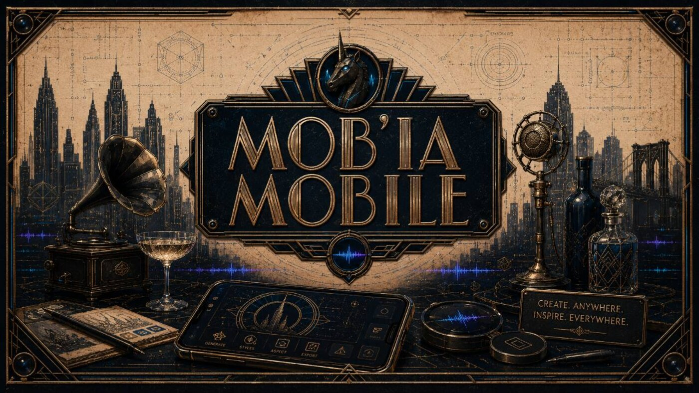

# Codex Model Orchestrator / AI Workflow Tools

  

  
  
  
  

  <strong>AI workflow tools for runs that can be read, checked, reused, and decided by a person.</strong>

  <a href="#english">English</a> ·
  <a href="#francais">Francais</a> ·
  <a href="docs/overview.md">Overview</a> ·
  <a href="docs/projects/codex-model-orchestrator.md">Orchestrator</a> ·
  <a href="docs/projects/mobia-ccomf-unity.md">Mob'ia</a> ·
  <a href="docs/resources.md">Resources</a>

## English

### What This Repository Presents

I work on AI tooling from the part that usually gets ignored after the first answer: what was asked, what was allowed, what the tool touched, what came out, what was checked, and what a person still needs to decide.

**Codex Model Orchestrator** is the main project. It is a control layer for AI-assisted work: scope the task, route the work, call tools, keep a readable run record, apply checks, and leave a decision surface instead of a vague "done".

The other projects make that idea concrete. **CodexToUnity** connects Codex, Unity, and ComfyUI around asset handoff. **Mob'ia / ccomf-unity** is the product layer for profiles, jobs, artifacts, and clients. **LocalAssetFactory** is the local loop that turns generated candidates into manifest-backed, importable, reviewable Unity assets.

### Start Here

Read [overview](docs/overview.md) for the full map. Read [Codex Model Orchestrator](docs/projects/codex-model-orchestrator.md) for the main project. Then read [CodexToUnity](docs/projects/codextounity.md), [Mob'ia / ccomf-unity](docs/projects/mobia-ccomf-unity.md), and [LocalAssetFactory](docs/projects/local-asset-factory.md) for the concrete workflow surfaces.

For practical use, start with [user flows](docs/user-flows.md) and [tutorials](docs/tutorials.md). For validation, use [evidence](docs/evidence.md), [evidence ledger](docs/evidence-ledger.md), [proof pack](docs/proof-pack.md), [QA matrix](docs/qa-matrix.md), and [QA validation](docs/qa-validation.md). For collaboration, funding, missions, or roles, read [project evaluation](docs/project-evaluation.md), [open needs](docs/partnership.md), and [decision pack](docs/decision-pack.md).

### Project Lines

  
  <strong>Codex Model Orchestrator is the priority.</strong> 
  It is about runs that explain themselves: goal, constraints, tool path, checks, evidence, weak points, and human decision. The product value is not "AI did something"; it is that another person can understand the work after the run.

 

  
  <strong>CodexToUnity gives the orchestration a real handoff.</strong> 
  The bridge connects Codex, Unity, and ComfyUI around jobs, manifests, dry runs, generated candidates, import checks, and review notes.

 

  
  <strong>Mob'ia / ccomf-unity turns generation into a product surface.</strong> 
  Profiles, jobs, artifact states, clients, and review decisions make ComfyUI-style work easier to follow for users, collaborators, and product reviewers.

 

### What A Reader Can Find

- A clear main project: Codex Model Orchestrator.
- Project pages for CodexToUnity, Mob'ia / ccomf-unity, and LocalAssetFactory.
- User flows for readable AI runs, Unity handoff, ComfyUI product jobs, and local asset review.
- Evidence and QA pages that explain how a run becomes trustworthy enough to act on.
- Diagrams, banners, one-pager, proof dashboard, QA matrix, and brand assets.

### Open Needs

Useful help is concrete: MCP/App SDK review, run-summary UX, proof-card design, Unity/ComfyUI workflow feedback, local automation review, QA criteria, documentation, funding, mission work, and roles around developer tools, AI workflow products, creative pipelines, and human-in-the-loop systems.

Public contact route: [GitHub - Unicorn Who Dev](https://github.com/charli-dev420).

## Francais

### Ce Que Presente Ce Repo

Je travaille sur l'outillage IA a partir de la partie qu'on ignore souvent apres la premiere reponse: ce qui a ete demande, ce qui etait autorise, ce que l'outil a touche, ce qui est sorti, ce qui a ete verifie, et ce qu'une personne doit encore decider.

**Codex Model Orchestrator** est le projet principal. C'est une couche de pilotage pour le travail assiste par IA: cadrer la tache, router le travail, appeler les outils, garder un run lisible, appliquer des controles et laisser une surface de decision au lieu d'un vague "done".

Les autres projets rendent cette idee concrete. **CodexToUnity** relie Codex, Unity et ComfyUI autour du handoff asset. **Mob'ia / ccomf-unity** est la couche produit pour profils, jobs, artefacts et clients. **LocalAssetFactory** est la boucle locale qui transforme des candidats generes en assets Unity avec manifest, import et revue.

### Commencer Ici

Lire [overview](docs/overview.md) pour la carte generale. Lire [Codex Model Orchestrator](docs/projects/codex-model-orchestrator.md) pour le projet principal. Lire ensuite [CodexToUnity](docs/projects/codextounity.md), [Mob'ia / ccomf-unity](docs/projects/mobia-ccomf-unity.md) et [LocalAssetFactory](docs/projects/local-asset-factory.md) pour les surfaces de workflow concretes.

Pour l'usage pratique, commencer par [user flows](docs/user-flows.md) et [tutorials](docs/tutorials.md). Pour la validation, utiliser [evidence](docs/evidence.md), [evidence ledger](docs/evidence-ledger.md), [proof pack](docs/proof-pack.md), [QA matrix](docs/qa-matrix.md) et [QA validation](docs/qa-validation.md). Pour collaboration, financement, missions ou postes, lire [project evaluation](docs/project-evaluation.md), [open needs](docs/partnership.md) et [decision pack](docs/decision-pack.md).

### Lignes Projet

  
  <strong>Codex Model Orchestrator est la priorite.</strong> 
  Il sert a produire des runs qui s'expliquent: objectif, contraintes, chemin outil, controles, preuves, points faibles et decision humaine. La valeur produit n'est pas "l'IA a fait quelque chose"; c'est qu'une autre personne peut comprendre le travail apres le run.

 

  
  <strong>CodexToUnity donne a l'orchestration un vrai handoff.</strong> 
  Le pont relie Codex, Unity et ComfyUI autour de jobs, manifests, dry runs, candidats generes, controles d'import et notes de revue.

 

  
  <strong>Mob'ia / ccomf-unity transforme la generation en surface produit.</strong> 
  Profils, jobs, etats artefact, clients et decisions de revue rendent le travail type ComfyUI plus lisible pour utilisateurs, collaborateurs et reviewers produit.

 

### Ce Qu'Un Lecteur Trouve

- Un projet principal clair: Codex Model Orchestrator.
- Des pages projet pour CodexToUnity, Mob'ia / ccomf-unity et LocalAssetFactory.
- Des flux utilisateur pour runs IA lisibles, handoff Unity, jobs produit ComfyUI et revue asset locale.
- Des pages evidence et QA qui expliquent comment un run devient assez fiable pour agir.
- Diagrammes, bannieres, one-pager, dashboard preuve, matrice QA et assets de marque.

### Besoins Ouverts

L'aide utile est concrete: revue MCP/App SDK, UX de resume de run, design proof-card, feedback workflow Unity/ComfyUI, revue automatisation locale, criteres QA, documentation, financement, missions et postes autour des outils developpeur, produits workflow IA, pipelines creatifs et systemes human-in-the-loop.

Contact public: [GitHub - Unicorn Who Dev](https://github.com/charli-dev420).
