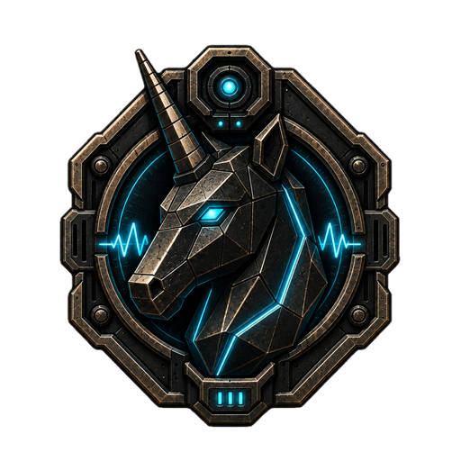

# Agentic Project Presentation / Presentation projet agentic

  

> Public-safe showcase for agentic orchestration, MCP, Apps SDK, Unity bridges, and local asset workflows. This repository is a documentation and partnership hub, not a source-code release.

[FR](#francais) | [EN](#english) | [One-pager](docs/one-pager.md) | [Public scope](docs/public-scope.md)

## Francais

### Positionnement

Cette vitrine presente l'axe **agentic / orchestration / Apps SDK / MCP**: des agents qui pilotent des outils, deleguent, produisent des preuves, affichent des interfaces lisibles et respectent des garde-fous.

Elle est la vitrine de plusieurs projets reels. Elle ne publie pas leur code sensible: elle fournit la documentation permettant de comprendre, evaluer et discuter collaboration, financement ou emploi.

### Lire dans le bon ordre

| Besoin | Document |
| --- | --- |
| Comprendre l'ecosysteme | [One-pager](docs/one-pager.md), [ecosystem map](docs/ecosystem-map.md) |
| Voir l'etat actuel | [Statut courant](docs/current-status.md), [notes de diligence](docs/blockers.md) |
| Evaluer chaque projet | [Orchestrateur](docs/projects/codex-model-orchestrator.md), [CodexToUnity](docs/projects/codextounity.md), [Mob'ia / ccomf-unity](docs/projects/mobia-ccomf-unity.md), [LocalAssetFactory](docs/projects/local-asset-factory.md) |
| Suivre les usages | [Flux utilisateur](docs/user-flows.md), [tutoriels](docs/tutorials.md) |
| Juger les preuves | [Evidence](docs/evidence.md), [evidence ledger](docs/evidence-ledger.md), [proof pack](docs/proof-pack.md), [QA matrix](docs/qa-matrix.md), [buyer evaluation](docs/buyer-evaluation.md) |
| Evaluer securite et donnees | [Security & privacy](docs/security-privacy.md), [redaction policy](docs/redaction-policy.md), [visuals](docs/visual-index.md) |
| Voir les vrais repos couverts | [Repos couverts](docs/repositories.md) |
| Preparer une collaboration | [Decision pack](docs/decision-pack.md) |
| Identifier la marque | [Charte](docs/brand-charter.md), [iconographie](docs/iconography.md), [assets](assets/README.md) |

### Repos et surfaces couverts

- `codex-model-orchestrator-plugin` - orchestrateur multi-agents, Apps SDK, MCP et proof kit, source privee/localisee.
- [`charli-dev420/codextounity`](https://github.com/charli-dev420/codextounity) - pont public Codex / Unity / ComfyUI.
- **Mob'ia / ccomf-unity** - backend et frontends produit autour de ComfyUI, prive.
- `LocalAssetFactory / Asset Factory` - pipeline local d'assets, generation, validation et import Unity, non publie comme code.

`brandforge-desk` n'est pas retenu dans cette vitrine.

### Demontre maintenant

| Surface | Signal |
| --- | --- |
| Orchestration | Niveaux de preuve L0-L5, quality gates, mesure cout/taches acceptees, score humain et temps de correction. |
| Unity asset loop | Prototype CodexToUnity, Asset Factory, jobs, manifest, sockets, normalisation GLB et revue humaine. |
| Mob'ia / ccomf-unity | Couche produit ComfyUI: profils, jobs async, artefacts et clients Unity/web/mobile. |
| Gouvernance | Redaction, separation read/write, confirmation humaine et preuves lisibles. |

### Ce qui est public ici

Architecture produit, cartes de roles, parcours utilisateur, tutoriels, niveaux de preuve publics, limites, roadmap, charte visuelle et brief de decision.

### Ce qui reste exclu

Aucun code source de plugin ou serveur MCP prive, prompt, trace, token, endpoint, configuration locale, outil destructif, workflow interne, log, dataset, modele, build ou historique operationnel sensible n'est publie ici.

### Recherche

Le projet recherche des partenariats autour d'outils agentiques, du financement pour industrialisation/securite/UX, et des missions ou emplois sur Apps SDK, MCP, agents locaux, orchestration et outils developpeur.

Contact public recommande: [GitHub charli-dev420](https://github.com/charli-dev420).

## English

### Positioning

This showcase presents the **agentic / orchestration / Apps SDK / MCP** track: agents that control tools, delegate work, produce evidence, render readable interfaces, and operate under guardrails.

It is the public showcase for several real projects. It does not publish sensitive implementation; it provides the documentation needed to understand, evaluate, and discuss collaboration, funding, or work opportunities.

### Start here

| Need | Document |
| --- | --- |
| Understand the ecosystem | [One-pager](docs/one-pager.md), [ecosystem map](docs/ecosystem-map.md) |
| Review current state | [Current status](docs/current-status.md), [readiness notes](docs/blockers.md) |
| Evaluate each project | [Orchestrator](docs/projects/codex-model-orchestrator.md), [CodexToUnity](docs/projects/codextounity.md), [Mob'ia / ccomf-unity](docs/projects/mobia-ccomf-unity.md), [LocalAssetFactory](docs/projects/local-asset-factory.md) |
| Follow usage | [User flows](docs/user-flows.md), [tutorials](docs/tutorials.md) |
| Judge evidence | [Evidence](docs/evidence.md), [evidence ledger](docs/evidence-ledger.md), [proof pack](docs/proof-pack.md), [QA matrix](docs/qa-matrix.md), [buyer evaluation](docs/buyer-evaluation.md) |
| Evaluate security and data | [Security & privacy](docs/security-privacy.md), [redaction policy](docs/redaction-policy.md), [visuals](docs/visual-index.md) |
| Review covered repositories | [Covered repositories](docs/repositories.md) |
| Prepare collaboration | [Decision pack](docs/decision-pack.md) |
| Identify the brand | [Brand charter](docs/brand-charter.md), [iconography](docs/iconography.md), [assets](assets/README.md) |

### Covered repositories and surfaces

- `codex-model-orchestrator-plugin` - multi-agent orchestration, Apps SDK, MCP, and proof kit, private/local source.
- [`charli-dev420/codextounity`](https://github.com/charli-dev420/codextounity) - public Codex / Unity / ComfyUI bridge.
- **Mob'ia / ccomf-unity** - private backend and product frontends around ComfyUI.
- `LocalAssetFactory / Asset Factory` - local asset pipeline for generation, validation, and Unity import, not published as source.

`brandforge-desk` is not retained in this showcase.

### Demonstrated Now

| Surface | Signal |
| --- | --- |
| Orchestration | L0-L5 evidence levels, quality gates, cost per accepted task, human score, and correction time. |
| Unity asset loop | CodexToUnity prototype, Asset Factory, jobs, manifest, sockets, GLB normalization, and human review. |
| Mob'ia / ccomf-unity | ComfyUI product layer: profiles, async jobs, artifacts, Unity/web/mobile clients. |
| Governance | Redaction, read/write separation, human confirmation, and readable evidence. |

This repository publishes product architecture, role maps, user journeys, tutorials, public proof levels, limits, roadmap, visual identity, and decision material. It excludes private plugin/server source, prompts, traces, tokens, endpoints, local configs, destructive tooling, internal workflows, logs, datasets, models, builds, and sensitive operational history.
