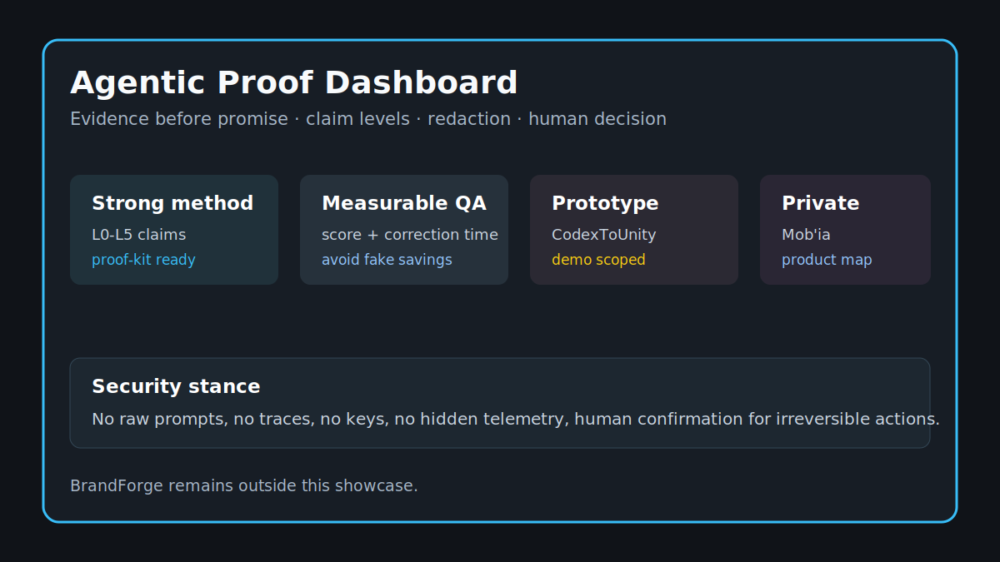

# Current Status / Statut courant

[EN](#english) | [FR](#francais)

## English

### Public State

The repo now has a clear product structure. **Codex Model Orchestrator** is the main project. **CodexToUnity**, **Mob'ia / ccomf-unity**, and **LocalAssetFactory** are concrete workflow surfaces around Unity, ComfyUI, and asset review.

### What Is Strongest

The strongest current signal is the method: scope the run, make tool actions readable, record evidence, apply checks, and leave a human decision. The Unity and ComfyUI pages make that method easier to judge because they involve real artifacts and review criteria.

### What To Review Next

Pick one workflow and one output. For the orchestrator, review a run result card. For CodexToUnity, review a Unity handoff scenario. For Mob'ia / ccomf-unity, review a job/artifact/client state. For LocalAssetFactory, review one generated candidate through manifest, normalization, import, and scene usefulness.

## Francais

### Etat Public

Le repo a maintenant une structure produit claire. **Codex Model Orchestrator** est le projet principal. **CodexToUnity**, **Mob'ia / ccomf-unity** et **LocalAssetFactory** sont des surfaces de workflow concretes autour de Unity, ComfyUI et revue asset.

### Signal Le Plus Fort

Le signal courant le plus fort est la methode: cadrer le run, rendre les actions outil lisibles, enregistrer la preuve, appliquer les controles et laisser une decision humaine. Les pages Unity et ComfyUI rendent cette methode plus facile a juger parce qu'elles impliquent de vrais artefacts et criteres de revue.

### Quoi Reviewer Ensuite

Choisir un workflow et une sortie. Pour l'orchestrateur, reviewer une carte de resultat de run. Pour CodexToUnity, reviewer un scenario de handoff Unity. Pour Mob'ia / ccomf-unity, reviewer un etat job/artefact/client. Pour LocalAssetFactory, reviewer un candidat genere via manifest, normalisation, import et utilite scene.
