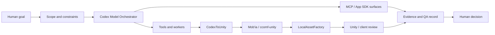
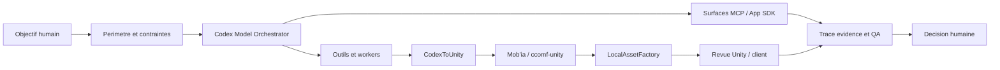

# Ecosystem Map / Carte ecosysteme

[EN](#english) | [FR](#francais)

## English

### Product Map

The ecosystem is a set of controlled AI workflow loops.

**Codex Model Orchestrator** scopes and records the run. **MCP/App SDK surfaces** make tool state and decisions visible. **CodexToUnity**, **Mob'ia / ccomf-unity**, and **LocalAssetFactory** provide concrete Unity, ComfyUI, and asset workflows where the run can be checked against real artifacts.

### Control Loop

1. A person states a goal and boundaries.
2. The orchestrator turns it into a scoped task.
3. Tools or workers operate inside that scope.
4. The workflow records the artifact, checks, uncertainty, and decision point.
5. A readable surface lets a person accept, revise, reuse, or stop.

### How To Read The Pieces

Codex Model Orchestrator is the product center. CodexToUnity shows a public Unity bridge. Mob'ia / ccomf-unity shows the product layer around generation jobs. LocalAssetFactory shows the local asset loop from candidate to Unity review.

The ecosystem is credible when a reader can answer: what was requested, what was allowed, what acted, what artifact exists, what was checked, and what a person decided.

## Francais

### Carte Produit

L'ecosysteme est un ensemble de boucles controlees de workflow IA.

**Codex Model Orchestrator** cadre et documente le run. **Les surfaces MCP/App SDK** rendent l'etat outil et les decisions visibles. **CodexToUnity**, **Mob'ia / ccomf-unity** et **LocalAssetFactory** apportent des workflows Unity, ComfyUI et assets ou le run peut etre controle contre de vrais artefacts.

### Boucle De Controle

1. Une personne donne un objectif et des limites.
2. L'orchestrateur transforme cela en tache cadree.
3. Les outils ou workers operent dans ce perimetre.
4. Le workflow enregistre artefact, controles, incertitude et point de decision.
5. Une surface lisible permet a une personne d'accepter, reviser, reutiliser ou arreter.

### Comment Lire Les Pieces

Codex Model Orchestrator est le centre produit. CodexToUnity montre un pont Unity public. Mob'ia / ccomf-unity montre la couche produit autour des jobs de generation. LocalAssetFactory montre la boucle asset locale du candidat a la revue Unity.

L'ecosysteme est credible quand un lecteur peut repondre: qu'est-ce qui etait demande, qu'est-ce qui etait autorise, qu'est-ce qui a agi, quel artefact existe, qu'est-ce qui a ete controle et quelle decision humaine a ete prise.
