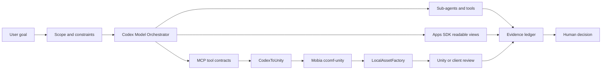
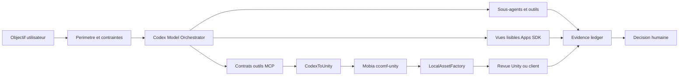

# Ecosystem Map / Carte ecosysteme

[EN](#english) | [FR](#francais)

## English

### Product Map

The ecosystem is a set of controlled loops, not a list of disconnected demos. The orchestrator frames the work, MCP tools expose capabilities, Apps SDK surfaces make state readable, project-specific workflows execute the task, and the human decides whether the result is accepted.

| Surface | Role | Interaction | Public status |
| --- | --- | --- | --- |
| Codex Model Orchestrator | Plans, delegates, measures, summarizes, and qualifies work. | Coordinates sub-agents, tools, proof kits, benchmark language, and Apps SDK / MCP views. | Private/local source, public method and product narrative. |
| MCP / Apps SDK layer | Turns agent capabilities into explicit tools and readable UI surfaces. | Separates read-only status from controlled mutating actions and decision views. | Concepts and public-safe examples. |
| CodexToUnity | Connects Codex, Unity, and ComfyUI for asset-oriented experiments. | Frames jobs, manifests, dry-runs, and Unity handoff checks. | Public repository and public showcase docs. |
| Mob'ia / ccomf-unity | Product layer around ComfyUI profiles, jobs, artifacts, and clients. | Gives Unity/web/mobile users a product surface around generation state and review. | Private source, public product map. |
| LocalAssetFactory | Local generation, normalization, Unity import, socket mapping, and scene validation. | Closes the loop from intent to generated candidate to reviewable Unity asset. | Private/local source, public workflow model. |
| Evidence and QA | Ledger, proof cards, QA matrix, redaction, and human decisions. | Converts runs into material a user, buyer, or reviewer can inspect. | Public-safe summaries only. |

### Control Loop

1. A person states a goal and the boundaries.
2. The orchestrator converts it into an explicit plan.
3. Tools and sub-agents operate inside that plan.
4. The system records status, evidence level, cost signals, and failure/revision reasons.
5. The Apps SDK / MCP surface makes the state readable.
6. A human accepts, revises, rejects, or escalates the result.

### Evaluation Angle

The ecosystem is credible when a reader can answer: what was asked, what was allowed, what acted, what changed, what evidence exists, who decided, and what remains private.

## Francais

### Carte Produit

L'ecosysteme est un ensemble de boucles controlees, pas une liste de demos separees. L'orchestrateur cadre le travail, les outils MCP exposent les capacites, les surfaces Apps SDK rendent l'etat lisible, les workflows projet executent la tache et l'humain decide si le resultat est accepte.

| Surface | Role | Interaction | Statut public |
| --- | --- | --- | --- |
| Codex Model Orchestrator | Planifie, delegue, mesure, resume et qualifie le travail. | Coordonne sous-agents, outils, proof kits, langage benchmark et vues Apps SDK / MCP. | Source privee/locale, methode et narration produit publiques. |
| Couche MCP / Apps SDK | Transforme des capacites agentiques en outils explicites et interfaces lisibles. | Separe statut read-only, actions mutating controlees et vues de decision. | Concepts et exemples public-safe. |
| CodexToUnity | Connecte Codex, Unity et ComfyUI pour des experimentations orientees assets. | Cadre jobs, manifests, dry-runs et controles de handoff Unity. | Repo public et docs vitrine publiques. |
| Mob'ia / ccomf-unity | Couche produit autour de profils, jobs, artefacts et clients ComfyUI. | Donne aux utilisateurs Unity/web/mobile une surface produit autour de l'etat generation et revue. | Source privee, carte produit publique. |
| LocalAssetFactory | Generation locale, normalisation, import Unity, socket mapping et validation scene. | Ferme la boucle entre intention, candidat genere et asset Unity reviewable. | Source privee/locale, modele de workflow public. |
| Evidence et QA | Registre, proof cards, matrice QA, redaction et decisions humaines. | Transforme les runs en materiel inspectable par utilisateur, acheteur ou reviewer. | Resumes public-safe uniquement. |

### Boucle De Controle

1. Une personne donne un objectif et les frontieres.
2. L'orchestrateur le transforme en plan explicite.
3. Outils et sous-agents operent dans ce plan.
4. Le systeme enregistre statut, niveau de preuve, signaux de cout et raisons d'echec/revision.
5. La surface Apps SDK / MCP rend l'etat lisible.
6. Un humain accepte, revise, refuse ou escalade le resultat.

### Angle D'Evaluation

L'ecosysteme est credible quand un lecteur peut repondre: qu'est-ce qui etait demande, qu'est-ce qui etait autorise, qu'est-ce qui a agi, qu'est-ce qui a change, quelle preuve existe, qui a decide et ce qui reste prive.
