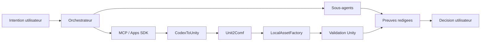

# Ecosystem Map / Carte ecosysteme

[FR](#francais) | [EN](#english)

## Francais

| Surface | Role | Interaction | Statut public |
| --- | --- | --- | --- |
| Codex Model Orchestrator | Planifier, deleguer, mesurer, produire preuves et rendus. | Coordonne sous-agents, outils et proof kit. | Source privee/localisee, concepts publics. |
| CodexToUnity | Relier Codex, Unity et ComfyUI. | Prototype d'orchestration Unity et generation. | Repo public. |
| Unit2Comf | Gerer jobs, profils, frontends et backend autour de ComfyUI. | Fournit une couche produit pour generation controlee. | Repo prive. |
| LocalAssetFactory | Pipeline local d'assets et validation Unity. | Execute des jobs locaux et controle import/scene. | Concepts publics, code non publie. |

### Positionnement

L'agent n'est pas seulement une interface texte. Il devient une couche de pilotage: cadrage, delegation, execution controlee, rendu lisible, preuve et decision humaine.

## English

The agent is not just a chat interface. It becomes a control layer: scoping, delegation, controlled execution, readable rendering, evidence, and human decision.
