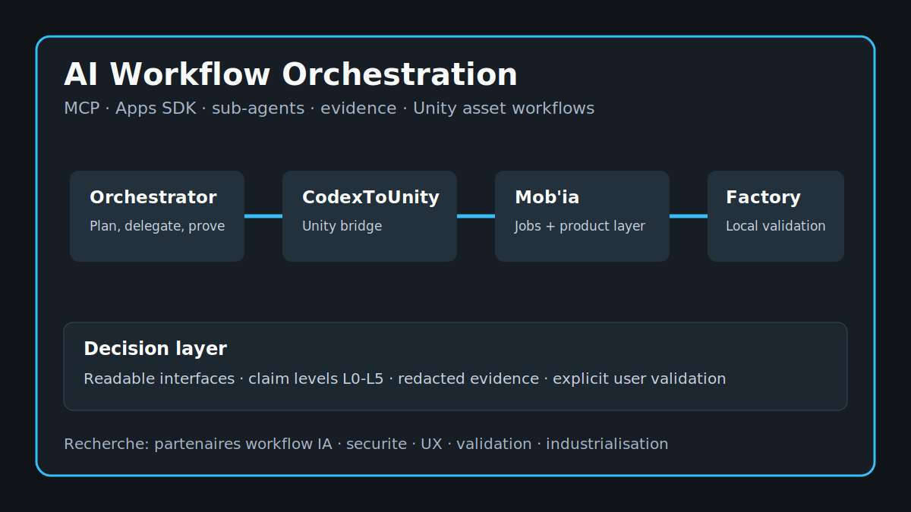

# Agentic Orchestration One-Pager

[EN](#english) | [FR](#francais)

## English

### What I Am Building

I am building tools for the part of AI work that usually gets messy: the handoff between an instruction, a tool call, a generated result, a verification step, and a human decision.

The center of the project is **Codex Model Orchestrator**. Around it, **CodexToUnity**, **Mob'ia / ccomf-unity**, and **LocalAssetFactory** let me test the same idea on concrete creative workflows: asset generation, Unity import, ComfyUI handoff, review states, proof cards, and client-ready summaries.

The goal is simple to say and hard to do well: make an AI-assisted run readable enough that someone can trust it, correct it, reuse it, or stop it.

### Why This Is Worth Looking At

Most AI demos show the answer. I am more interested in the work around the answer.

Who asked for it? Which tools were allowed? What changed? What evidence supports the result? Where did the run hesitate? What still needs a person? Could a collaborator, buyer, lead developer, or recruiter understand the result without digging through raw traces?

That is the product layer I want to make stronger. Not a black box, not a pile of prompts, but a workflow that can be inspected after the fact.

### What To Read First

Start with the [ecosystem map](ecosystem-map.md) to see the pieces together. Then read the [user flows](user-flows.md) and the [orchestrator proof loop](scenarios/orchestrator-proof-loop.md) to understand the shape of a real run.

For a more serious evaluation, use the [evidence ledger](evidence-ledger.md), [proof pack](proof-pack.md), [QA matrix](qa-matrix.md), and [buyer evaluation](buyer-evaluation.md). Those pages are meant to help someone form an opinion without needing a long meeting first.

### Good Conversations

I am open to conversations around product direction, MCP/App SDK surfaces, Unity or ComfyUI pipelines, local automation, QA and proof design, funding, missions, partnerships, and roles where AI tools need to be understandable by a real team.

The best starting point is one concrete workflow: what should happen, what must stay under control, what proof would make the result believable, and what decision the user should be able to make at the end.

## Francais

### Ce Que Je Construis

Je construis des outils pour la partie du travail IA qui devient vite floue: le passage entre une instruction, un appel outil, un resultat genere, une verification et une decision humaine.

Le centre du projet est **Codex Model Orchestrator**. Autour, **CodexToUnity**, **Mob'ia / ccomf-unity** et **LocalAssetFactory** me permettent de tester la meme idee sur des workflows creatifs concrets: generation d'assets, import Unity, handoff ComfyUI, etats de revue, cartes de preuve et resumes utilisables cote client.

L'objectif est simple a formuler et difficile a bien faire: rendre un run assiste par IA assez lisible pour qu'une personne puisse lui faire confiance, le corriger, le reutiliser ou l'arreter.

### Pourquoi Cela Merite D'Etre Regarde

La plupart des demos IA montrent la reponse. Ce qui m'interesse davantage, c'est le travail autour de la reponse.

Qui a demande quoi ? Quels outils etaient autorises ? Qu'est-ce qui a change ? Quelle preuve soutient le resultat ? Ou le run a-t-il hesite ? Qu'est-ce qui demande encore une personne ? Est-ce qu'un collaborateur, acheteur, lead dev ou recruteur peut comprendre le resultat sans fouiller dans des traces brutes ?

C'est cette couche produit que je veux renforcer. Pas une boite noire, pas une collection de prompts, mais un workflow que l'on peut relire apres coup.

### Lire D'Abord

Commencer par l'[ecosystem map](ecosystem-map.md) pour voir les pieces ensemble. Lire ensuite les [flux utilisateur](user-flows.md) et le [proof loop orchestrateur](scenarios/orchestrator-proof-loop.md) pour comprendre la forme d'un vrai run.

Pour une evaluation plus serieuse, utiliser l'[evidence ledger](evidence-ledger.md), le [proof pack](proof-pack.md), la [QA matrix](qa-matrix.md) et l'[evaluation acheteur](buyer-evaluation.md). Ces pages sont la pour aider quelqu'un a se faire une opinion sans avoir besoin d'une longue reunion d'abord.

### Bonnes Discussions

Je suis ouvert aux discussions autour de la direction produit, des surfaces MCP/App SDK, des pipelines Unity ou ComfyUI, de l'automatisation locale, du design QA/preuve, du financement, des missions, des partenariats et des postes ou les outils IA doivent rester comprehensibles pour une vraie equipe.

Le meilleur point de depart est un workflow concret: ce qui doit se passer, ce qui doit rester sous controle, quelle preuve rendrait le resultat credible et quelle decision l'utilisateur doit pouvoir prendre a la fin.
