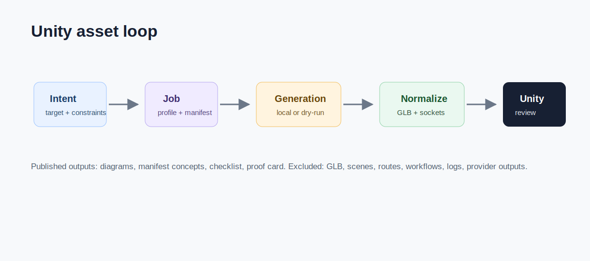

# LocalAssetFactory / Asset Factory

[EN](#english) | [FR](#francais)

## English

### Product Definition

LocalAssetFactory is the local asset production and validation loop. It connects intent, generation, manifest, normalization, Unity import, socket mapping, scene review, and written evidence.

It prevents generated files from being treated as finished too early. A candidate becomes useful only when it can be identified, imported, reviewed, and judged inside the target scene.

### Who It Helps

It helps technical artists, Unity users, asset pipeline builders, AI generation reviewers, and teams that need local asset workflows to be repeatable and inspectable.

### Workflow

1. The user describes the desired asset or scene role.
2. The system creates or simulates a generation job.
3. The expected artifact metadata is recorded.
4. Scale, orientation, naming, format, material, and socket expectations are checked.
5. The candidate is reviewed for Unity import and scene usefulness.
6. A person decides whether it should be accepted, revised, rejected, archived, or kept for later review.

### What This Repository Shows

This repo shows the workflow model, QA criteria, proof dashboard, diagram, scenario pages, and relationship to CodexToUnity and Mob'ia / ccomf-unity.

### Useful Support

Useful support includes Unity import QA, GLB/FBX review, naming and manifest design, scene validation, technical art feedback, ComfyUI/Trellis pipeline review, and local automation hardening.

## Francais

### Definition Produit

LocalAssetFactory est la boucle locale de production et validation d'assets. Elle connecte intention, generation, manifest, normalisation, import Unity, socket mapping, revue scene et preuve ecrite.

Elle evite de traiter un fichier genere comme termine trop tot. Un candidat devient utile seulement quand il peut etre identifie, importe, revu et juge dans la scene cible.

### A Qui Ca Sert

Elle sert aux technical artists, utilisateurs Unity, builders de pipeline asset, reviewers de generation IA et equipes qui veulent des workflows asset locaux repetables et inspectables.

### Workflow

1. L'utilisateur decrit l'asset souhaite ou son role scene.
2. Le systeme cree ou simule un job de generation.
3. Les metadonnees attendues de l'artefact sont enregistrees.
4. Echelle, orientation, nommage, format, materiau et attentes socket sont controles.
5. Le candidat est revu pour import Unity et utilite scene.
6. Une personne decide s'il faut accepter, reviser, refuser, archiver ou garder pour revue.

### Ce Que Montre Ce Repo

Ce repo montre le modele de workflow, les criteres QA, le dashboard preuve, le diagramme, les pages scenario et la relation a CodexToUnity et Mob'ia / ccomf-unity.

### Support Utile

Le support utile inclut QA import Unity, revue GLB/FBX, design nommage et manifest, validation scene, feedback technical art, revue pipeline ComfyUI/Trellis et durcissement automatisation locale.
