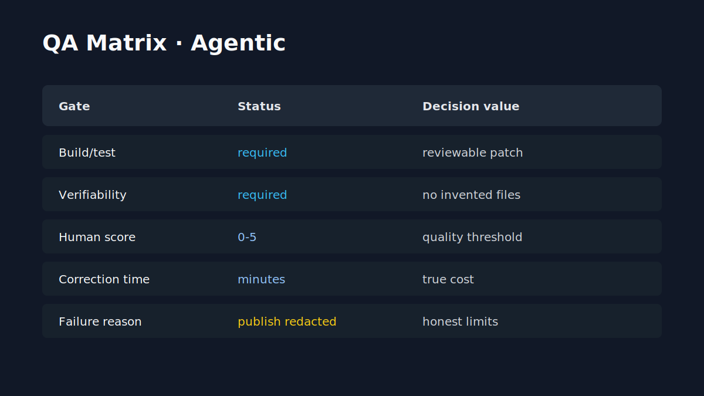

# QA Validation / Validation QA

[FR](#francais) | [EN](#english)

## Francais

| Gate | Ce qu'il valide | Statut public | Pourquoi c'est important |
| --- | --- | --- | --- |
| Build/test | Build, tests pertinents, patch reviewable. | Principe publie. | Evite les demos non verifiables. |
| Verifiability | Fichiers cites existants, findings checkables. | Principe publie. | Bloque hallucinations et claims invérifiables. |
| Human score | Score 0-5, seuil conseille 4/5. | Principe publie. | Mesure l'utilite reelle. |
| Human correction time | Minutes necessaires pour rendre utile. | Principe publie. | Evite les economies artificielles. |
| Failure reason | Echecs publies avec raison redigee. | Principe publie. | Rend les limites visibles. |

### Validation specifique asset/Unity

CodexToUnity et LocalAssetFactory doivent encore separer: dry-run, live ComfyUI, Unity import, mesh validation et preuve utilisateur. Tant que ces preuves ne sont pas redigees, elles ne doivent pas etre presentees comme production-ready.

## English

Agentic QA is based on build/test, verifiability, human scoring, correction time, and published failure reasons. Unity/asset workflows must distinguish dry-run, live generation, Unity import, mesh validation, and user proof.
